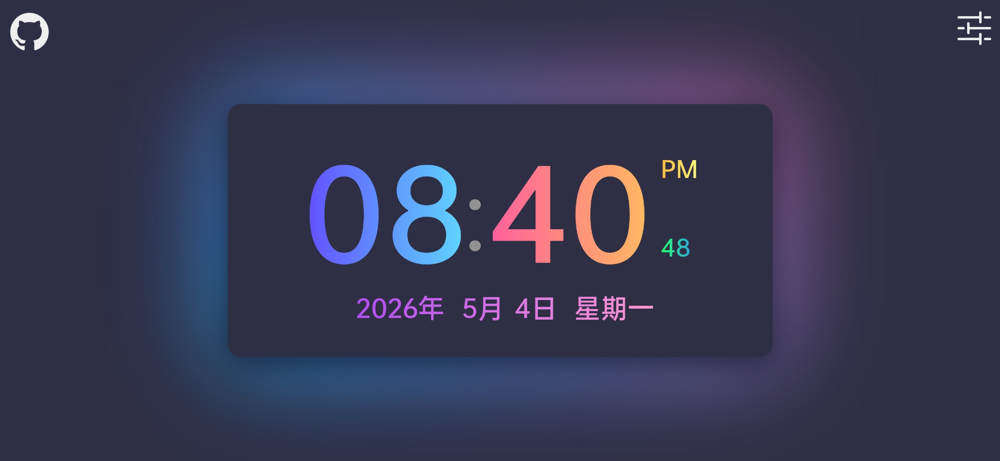
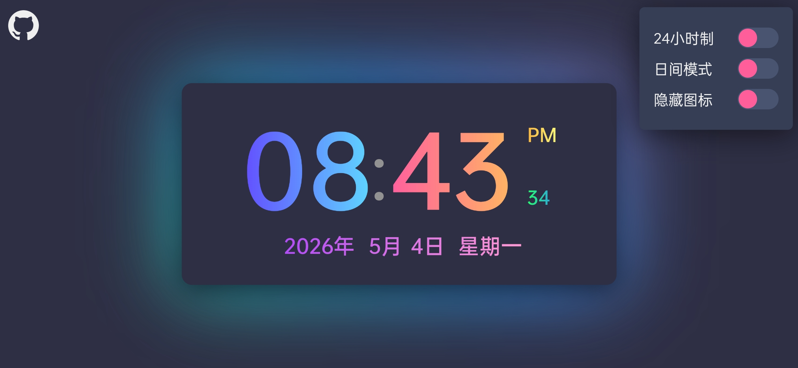
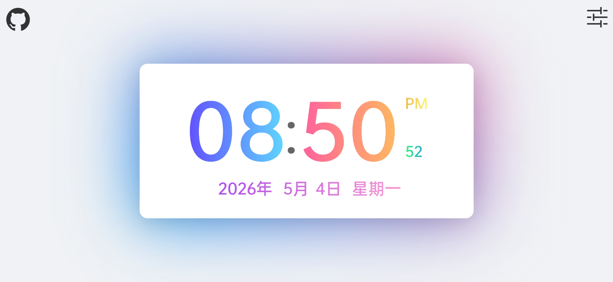
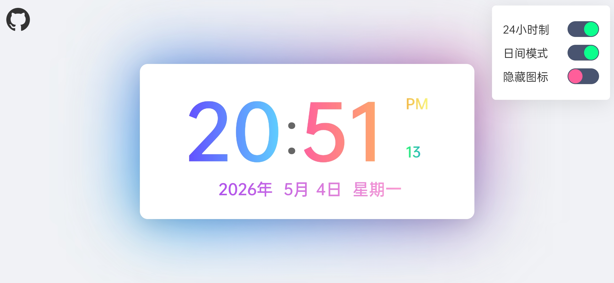

<div align="center">

# 漂亮闹钟
一个由bill74186制作的闹钟

<p>
  <a href="https://github.com/bill74186/Nice-Clock/stargazers"></a>
  <a href="https://github.com/bill74186/Nice-Clock/network/members"></a>
  <a href="LICENSE"></a>
</p>

---

[English](README.md) | **简体中文**

<p>
  
  
  
  
</p>

</div>

## 📌 项目介绍

- **中文名称**: 漂亮闹钟
- **英文名称**: Nice Clock
- **仓库介绍**: 一个由我做的闹钟
- **创立时间**: 2026/05/01
- **上传时间**: 2026/05/05
- **现版本号**: v1.1.4
- **开发人员**: bill74186

## 🎮 使用方法

> [!tip]
> 按需选择，能用就用

### 📱 线上使用

[点这里](https://bill74186.github.io/Nice-Clock/)
`https://bill74186.github.io/Nice-Clock/index.html/`
记得给个Star，求求了🥺

### 📦 克隆仓库

```bash
1️⃣ 使用GIT工具输入一下字符
2️⃣ git clone https://github.com/bill74186/Nice-Clock.git
3️⃣ 即可使用！（记得Star）
```

## 📸 使用截图
 
<p align="center">






</p>

## 👤 作者信息
 
- **真名**: 保密 😜
- **网名**: bill74186
- **年龄**: 刚满十八岁~
- **性格**: 非常懒，能不动就不动
- **爱好**: 玩游戏，学习编程

## 💬 作者的话

所有内容都由 *bill74186* 制作，所有人都可复制修改转发
 
可不可以给点 *money* 或者 *stars*？孩子没饭吃了🙃🙃🙃
 
文件做得有些冗余，能跑就行了
 
项目主页是 `index.html` ，务必以本地服务器运行

> [!important]
请以**本地服务器**或**专业工具**运行，不要以本地文件 `file://` 运行！

## 📁 项目架构

```
Nice-Clock/
├──README.md  # 英文版说明
├──README-CN.md  # 中文版说明
├──LICENSE  # MIT 许可证
├──index.html  # 网站主页
├──style.html  # 配置CSS文件
└──script.js  # 配置JS文件
```

> [!tip]
所有文件平铺在根目录上，方便查看和修改
 
## ❔ 还有吗？

> [!note]
> 没有了!<br>
> 自己弄去吧